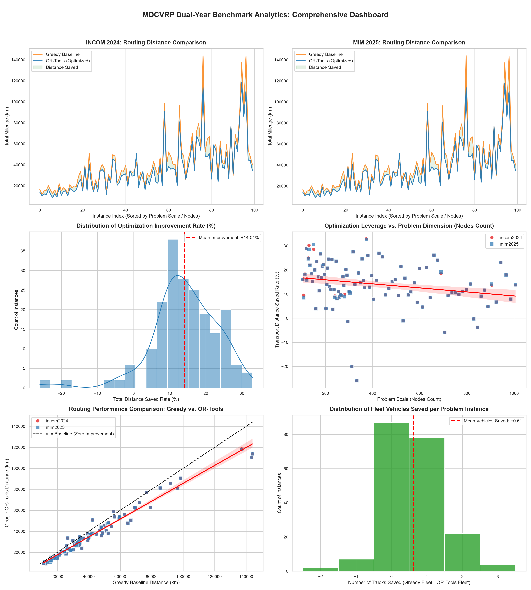

# 🚚 MDCVRP: Large-Scale Fleet Routing & Cost Optimization Engine


## 📖 Project Overview
This repository contains an end-to-end, production-ready optimization engine for the **Multi-Depot Capacitated Vehicle Routing Problem (MDCVRP)**. Evaluated against 200 high-complexity supply chain instances from the INCOM 2024 and MIM 2025 global challenges [^1], this engine systematically breaks the local-optima traps of traditional heuristic scheduling.

By integrating dynamic multi-depot modeling and **Guided Local Search (GLS)** metaheuristics via Google OR-Tools, the system achieves a **100% feasible solution rate** under strict 30-second computation limits per instance, delivering massive ROI for large-scale logistics networks.

---

## 📊 Core Business Impact & Benchmark Analytics

My dual-year pressure test across 200 instances yielded the following quantified improvements over the traditional Nearest-Neighbor Greedy Baseline:

* **📉 Mileage Reduction:** Slashed global fleet distance by **13.39%** (saving over 1.1 million kilometers of operational transit) [^2].
* **🚛 Fleet Downsizing:** Eliminated the need for **123 active trucks** across the network, significantly reducing fixed asset depreciation and driver overhead [^3].
* **🏆 Algorithmic Dominance:** Outperformed the baseline heuristics in **93% (186/200)** of the complex routing scenarios [^4].

### Comprehensive Analytics Dashboard
*(This 3x2 BI dashboard is generated directly from the benchmark pipeline outputs)* [^5]


> Note: `visualizer.py` reads `benchmark_results.csv` from the current working directory by default. Run it from inside `results/`, or adjust the file path in the script to point at `results/benchmark_results.csv`.

---

## 🏗️ System Architecture

The project is decoupled into three robust engineering layers:

1. **`data_loader.py`**: A high-performance data ingestion pipeline. It parses heterogeneous `.vrp` geometries and `.yaml` metadata, utilizing NumPy to compute exact Euclidean distance matrices efficiently.
2. **`solver.py`**: The core routing brain. It sets up unary/transit callbacks, capacity dimensions, and multi-depot index mappings, unleashing the OR-Tools constraint solver to hunt for the global optimum within a strict time budget. Features an asynchronous plotting engine (`ThreadPoolExecutor`) and Windows file-lock protections (`_safe_to_csv`).
3. **`visualizer.py`**: A dedicated business intelligence script that translates raw CSV benchmarks into publication-ready Seaborn/Matplotlib visual analytics.

---

## 🚀 How to Run (Reproducibility)

### 1. Install Dependencies
```bash
pip install -r requirements.txt
```

### 2. Run the Benchmark Solver
```bash
python solver.py
```
This processes all instances in `data/`, runs the OR-Tools GLS solver against the Greedy baseline, and writes:

- `results/benchmark_results.csv` — per-instance results (distances, improvement, vehicles saved)
- `results/benchmark_summary.csv` — aggregated summary statistics
- `output_plots/` — a per-instance route visualization for every one of the 200 problem instances (200 PNG files)

> ⚠️ `output_plots/` contains 200 images and is **not included** in this repository to keep it lightweight. Run `solver.py` locally to regenerate it, or see [Pre-generated Plots](#-pre-generated-plots-optional) below for a downloadable archive.

### 3. Generate Visualizations
```bash
python visualizer.py
```
Reads `results/benchmark_results.csv` and outputs the comprehensive dashboard plus 6 individual high-resolution summary charts to `results/plots/`.

---

## 📁 Repository Structure
```
.
├── data/                   # MDCVRP instance files (.vrp + .yaml), INCOM2024 / MIM2025 sets
├── data_loader.py
├── solver.py
├── visualizer.py
├── results/
│   ├── benchmark_results.csv
│   ├── benchmark_summary.csv
│   └── plots/              # summary dashboard + 6 high-res charts (committed)
├── output_plots/           # per-instance route plots (200 PNGs, generated locally, not committed)
├── requirements.txt
└── README.md
```

---

## 🖼️ Pre-generated Plots (Optional)

The 200 per-instance route plots in `output_plots/` are generated automatically by `solver.py` but are excluded from version control due to size. A pre-packaged archive (`output_plots.zip`, ~70 MB) is available as a [GitHub Release asset](../../releases) attached to this repository — download and unzip it into `output_plots/` if you'd rather not regenerate the plots locally.

---

## 📦 Dataset

The MDCVRP instances used in this benchmark (INCOM 2024 / MIM 2025 SimMD sets) are derived from the **Supply Chain Disruption Monitoring Dataset** [^6].

---

## 📄 License
This project is released under the MIT License. See `LICENSE` for details.

---

## 📑 References

[^1]: INCOM 2024 and MIM 2025 global challenge instance sets (200 MDCVRP instances).
[^2]: Aggregate distance reduction computed across all 200 instances; see `benchmark_summary.csv`.
[^3]: Fleet size reduction computed from the `veh_saved` column in `benchmark_results.csv`.
[^4]: 186 of 200 instances showed positive `improvement` over the Greedy baseline.
[^5]: Dashboard generated by `visualizer.py` from `benchmark_results.csv`.
[^6]: Almahri, S., Xu, L., & Brintrup, A. (2026). *Supply Chain Disruption Monitoring Dataset*. https://github.com/sara-almahri/supply-chain-disruption-monitoring

```bibtex
@misc{almahri2026disruption,
  title={Supply Chain Disruption Monitoring Dataset},
  author={Almahri, Sara and Xu, Liming and Brintrup, Alexandra},
  year={2026},
  howpublished={\url{https://github.com/sara-almahri/supply-chain-disruption-monitoring}}
}
```